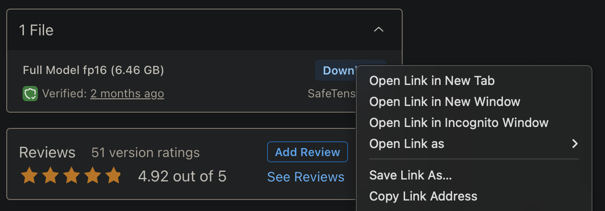

# SDVN10-Anime Cog model

This is an implementation of the [SDVN10-Anime](https://civitai.com/models/254012/sdvn10-anime) as a Cog model. [Cog packages machine learning models as standard containers.](https://github.com/replicate/cog)

You can use this template to deploy any [CivitAI](https://civitai.com) model to [Replicate](https://replicate.com/). Just change the `MODEL_LINK` value in `predict.py` to the model you want to deploy.

To get the URL, find the safetensors file and select "Copy Link Address"


Install the [cog cli](https://cog.run):
```bash
sudo curl -o /usr/local/bin/cog -L https://github.com/replicate/cog/releases/latest/download/cog_`uname -s`_`uname -m`
sudo chmod +x /usr/local/bin/cog
```

Install the requirements:
```bash
pip install -r requirements.txt
```

Then, download the pre-trained weights:
```bash
cog run script/download-weights
```

Then, you can run predictions:
```bash
cog predict -i prompt="child boy, short hair, crew neck sweater, (masterpiece, best quality:1.6), ghibli, Sun in the sky, Rocky Mountain National Park, Charismatic"
```
## Example

Output:


